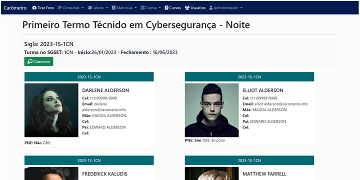
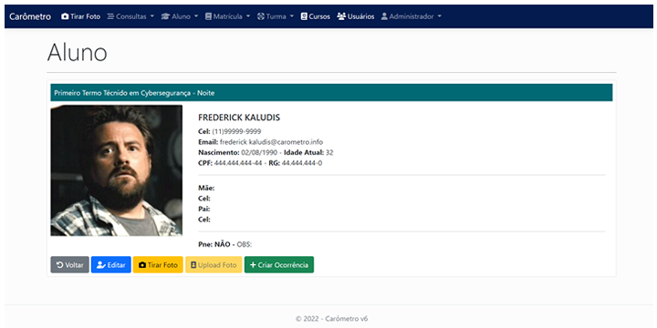
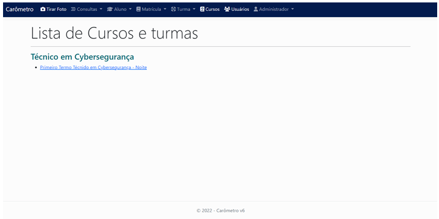
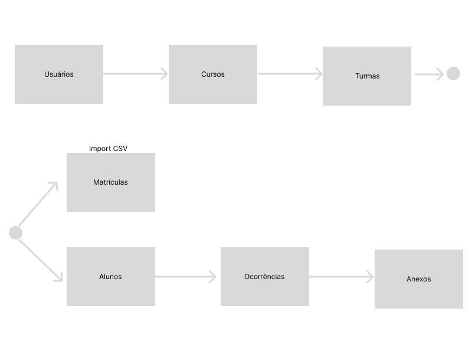

# Carômetro

**Carômetro** é uma aplicação que contém informações pertinentes do aluno contendo a foto e informações mais utilizadas pelas pessoas da secretaria e coordenação escolar.

Em busca da redução na evasão através de ações rápidas e humanizadas, o objetivo do **Carômetro** é proporcionar um atendimento mais acolhedor para aluno feito pela coordenação, pedagogos e coordenador de estágios.

## Com **Carômetro** é possível:
* Criar ou importar ficha cadastral do aluno e colocar sua foto no perfil;
* Criar ocorrências com anexos de documentos do dia, dia do aluno como: “falta, comportamento, encaminhamentos, etc...”;
* Envio de e-mails automático para toda coordenação a cada ocorrência criada.
* Acompanhar as tratativas das ocorrências dado pela equipe de coordenação;
* Contatar o aluno os responsáveis de forma ágil;
* Ter acesso ao Classroom que o aluno participa.

Muitas outras funcionalidades estão sendo pensadas e desenvolvidas, afim de contribuir no dia, da gestão escolar.

> **Carômetro,** significado no dicionário informal:
> Repositório de informações pertinentes de uma pessoal associada a uma foto de rosto.

 

## Tela Turma Alunos

## Tela Detalhe Aluno

## Tela Turmas

## Fluxo de cadastros

## Atenção aos itens para o deploy:

1.  Dar acesso de gravação para o usuário padrão do IIS na pasta “wwwroot\Files”

2.  Para acessar os recursos do navegador como a câmera, é necessário o uso do protocolo HTTPS. Sendo assim o IIS deve ter um certificado SSL.

 

## Certificado SSL para o IIS

Caso você não tenha o certificado, pode criar um para testes utilizando os comandos em powershell. 

Para esse comando e necessário executar o powershell em modo admin.

<pre>
    <code>New-SelfSignedCertificate -CertStoreLocation Cert:\LocalMachine\My -DnsName "local.nomesite.com.br" -FriendlyName "Nomesite" -NotAfter (Get-Date).AddYears(10) 
    </code>
</pre>

